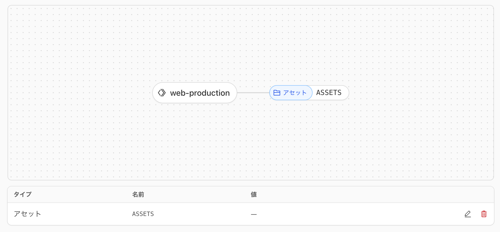

<samp>
<p align="center">
  
</p>

<h1 align="center">web</h1>

<!-- Badge -->
<p align="center">
<a href="https://github.com/nw-union/web/actions/workflows/push_main.yml"></a>
<a href="https://discord.com/channels/805068364476973076/1396169702866419906"></a>
</p>

<!-- About this Project -->
<p align="center">
ウェブサイト。ドキュメント置き場
</p>
<br />

## 🌏 URL

| Name       | URL                       |
| :--------- | :------------------------ |
| Production | https://nw-union.net/     |
| Local (Dev)| http://localhost:5173/    |
| Local (Wrangler) | http://localhost:8787/ |

<br/>

## 🔰 Getting Started

### Codespaces

[](https://github.com/codespaces/new?hide_repo_select=true&ref=main&repo=nw-union/web)

### ローカルサーバー起動方法

0. 最新バージョンの [Bun](https://bun.com/) が動く環境であること
1. 依存パッケージ取得
```bash
bun install --frozen-lockfile
```
2. 開発サーバー起動
```
bun run dev
```
🏃 http://localhost:5173

またはWranglerローカル環境で起動する場合:
```
bun run start
```
🏃 http://localhost:8787

<br/>

### ドキュメント管理

ドキュメントはCloudflare D1データベースで管理されています。TipTapエディタを使用してWebインターフェースから作成・編集できます。

データベース操作コマンド:
```bash
# マイグレーション生成
bun run db:generate

# ローカルDBにマイグレーション適用
bun run db:migrate:local

# サンプルデータ投入
bun run db:sampledata:local
```

<br/>

### その他

React Router v7 + Cloudflare Workers + Drizzle ORM (D1) で構築されたドキュメントプラットフォームです。ヘキサゴナルアーキテクチャを採用しています。詳細なアーキテクチャ、開発ルール、使用可能なコマンドなどは [CLAUDE.md](./CLAUDE.md) を参照してください。

<br/>

## 🏗️ Build

```
bun run build
```

<br/>

## 🚀　Infrastructure

アプリケーションは、nw-union の Cloudflare Workers で動いています。



main ブランチにマージされると、GitHub Actions により、デプロイされます。

<br/>
<br/>

--

Happy hacking 💛
</samp>
